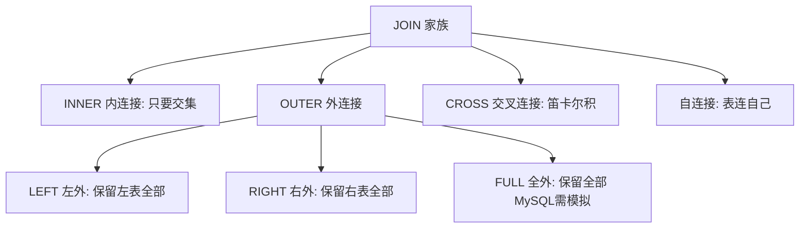
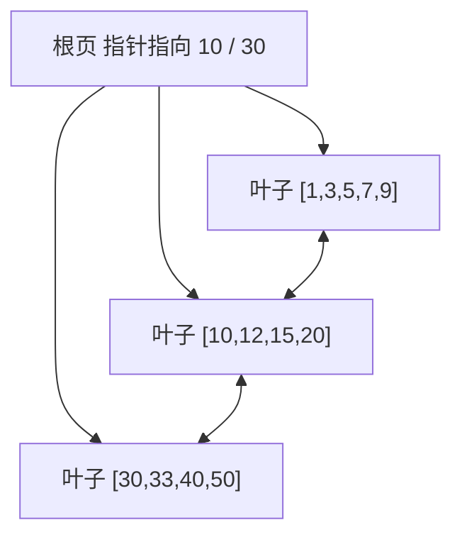
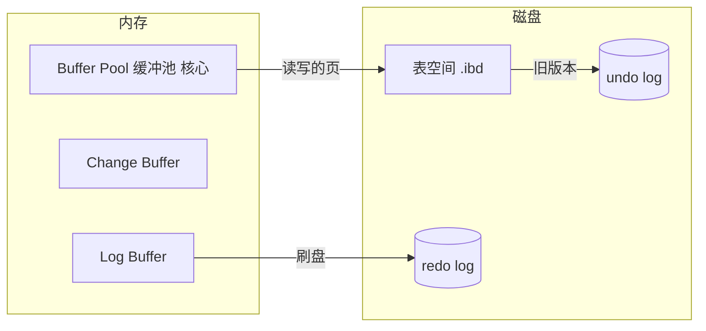
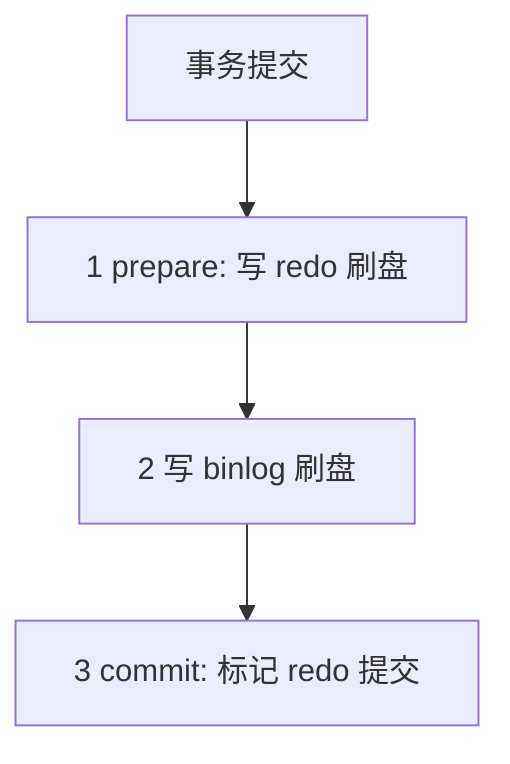

# MySQL 学习笔记（新手版）

这份笔记写给第一次接触数据库的人。MySQL 本身不算难，难的是很多教程一上来就堆术语，把人劝退。所以这里先讲清楚"数据库到底是什么"，再带你从装环境一路敲到能建表、查数据、加索引。

建议边看边敲，光看是记不住的。全程用一套博客系统的表（用户 / 文章 / 评论）举例子，所有 SQL 都能连起来跑。带 `::: details` 标记的原理部分，第一遍可以跳过，等你想搞懂"为什么"或者准备面试时再看。

主线（0～7 章）三五天能上手日常增删改查；后面的原理和运维章节，工作上遇到需要了再深入也来得及。

---

## 0. 数据库到底是什么

先别急着记命令，用一个你一定懂的东西来类比：Excel。

### 把数据库想成"超强的 Excel"

| 你熟悉的 Excel | 数据库里的说法 | 说明 |
|---|---|---|
| 一个 Excel 文件（工作簿） | 数据库 Database | 装一类数据的"大容器" |
| 文件里的一张表 | 表 Table | 存同一类东西，比如"所有用户" |
| 表里的一行 | 行 Row / 记录 | 一条具体数据，比如"用户小明" |
| 表里的一列 | 列 Column / 字段 | 一种属性，比如"用户名""年龄" |

那为什么不直接用 Excel？因为 Excel 数据量大了（几十万行）就卡、多人同时改会冲突、也没法写"自动统计每篇文章评论数"这种规则，程序也很难安全地读写。数据库就是专门解决这些问题的"工业级表格工具"。

MySQL 是数据库软件里最流行的开源关系型之一，免费、简单、资料多，很适合入门，也是大量公司的主力。

有一点要先分清：SQL 是"跟数据库说话的语言"，MySQL 是"听得懂 SQL 的一个软件"。就像英语是语言，某个英国人是一个具体的人。

---

## 1. 先把环境跑起来

目标就一个：在你电脑上有一份能用的 MySQL，并且成功执行第一条查询。

### 方式一：用 Docker 起（最干净，推荐）

```bash
docker run -d --name mysql80 -p 3306:3306 \
  -e MYSQL_ROOT_PASSWORD=root123 \
  -e MYSQL_DATABASE=blog \
  mysql:8.0

# 另开一个终端连进去
docker exec -it mysql80 mysql -uroot -proot123 blog
```

### 方式二：本机直接装

- macOS：`brew install mysql`，然后 `brew services start mysql`
- Windows：去 mysql.com 下载 MySQL Installer，一路下一步
- 连入命令同上：`mysql -uroot -p blog`

### 方式三：不想装环境

打开 SQLZoo 或牛客网的 SQL 题库，浏览器里就能写 SQL，零安装，适合先找找语感。

### 第一条查询

连上之后敲这一行回车：

```sql
SELECT 1 + 1;
```

能看到结果 `2`，就说明环境通了，这第一步就算完成了。

---

## 2. 建库建表：先有容器，再放东西

### 2.1 创建数据库

```sql
CREATE DATABASE IF NOT EXISTS blog
  DEFAULT CHARACTER SET utf8mb4
  COLLATE utf8mb4_general_ci;

USE blog;   -- 告诉 MySQL：接下来我都在 blog 这个库里操作
```

`utf8mb4` 一定要用。老教程里写的 `utf8` 在 MySQL 里其实是"假全量"，存 emoji 会报错。

### 2.2 一张表由什么组成

以"用户表"为例，先想清楚要存什么：每个用户要有唯一编号、用户名、邮箱、注册时间。

```sql
CREATE TABLE users (
  id          BIGINT PRIMARY KEY AUTO_INCREMENT,  -- 自动增长的主键
  username    VARCHAR(50)  NOT NULL,              -- 用户名，不能为空
  email       VARCHAR(100) NOT NULL,
  age         TINYINT UNSIGNED DEFAULT 0,         -- 年龄，默认 0
  created_at  DATETIME     DEFAULT CURRENT_TIMESTAMP  -- 默认取当前时间
) ENGINE=InnoDB DEFAULT CHARSET=utf8mb4;
```

几个第一次见但必须懂的词：

- **主键 PRIMARY KEY**：能唯一确定一行的"身份证"，比如 id=5 永远指"小明"。一张表只能有一个主键。
- **AUTO_INCREMENT**：插入时不用自己填 id，数据库自动加一，绝不重复。
- **NOT NULL**：这一列不能不填。
- **DEFAULT**：不填时自动用的值。

### 2.3 数据类型怎么选

不用背，记住"存什么就用什么类型"：

| 想存的东西 | 用哪个类型 | 例子 |
|---|---|---|
| 名字、标题、文字 | `VARCHAR(长度)` | 用户名 `VARCHAR(50)` |
| 长文章、简介 | `TEXT` | 博客正文 |
| 整数（年龄、数量） | `INT` / `BIGINT` | 年龄 `INT` |
| 钱、价格（必须精确） | `DECIMAL(10,2)` | 价格 `DECIMAL(10,2)` |
| 是否（真/假） | `TINYINT`(0/1) 或 `BOOLEAN` | 是否删除 |
| 日期时间 | `DATETIME` | 创建时间 |
| 固定选项 | `ENUM('a','b')` | 状态 |

钱千万别用 `FLOAT` / `DOUBLE`。它们有精度误差，0.1+0.2 在计算机里可能不是 0.3，对账会出大事。金额一律用 `DECIMAL`。

### 2.4 把博客的三张表都建好

一次建好"用户 / 文章 / 评论"三张表，后面所有例子都基于它们：

```sql
-- 用户
CREATE TABLE users (
  id         BIGINT PRIMARY KEY AUTO_INCREMENT,
  username   VARCHAR(50)  NOT NULL,
  email      VARCHAR(100) NOT NULL,
  age        TINYINT UNSIGNED DEFAULT 0,
  created_at DATETIME     DEFAULT CURRENT_TIMESTAMP
) ENGINE=InnoDB DEFAULT CHARSET=utf8mb4;

-- 文章（user_id 指向 users.id，表示"这篇是谁写的"）
CREATE TABLE posts (
  id         BIGINT PRIMARY KEY AUTO_INCREMENT,
  user_id    BIGINT       NOT NULL,
  title      VARCHAR(200) NOT NULL,
  content    TEXT,
  views      INT          DEFAULT 0,
  status     ENUM('draft','published') DEFAULT 'draft',
  created_at DATETIME     DEFAULT CURRENT_TIMESTAMP,
  INDEX idx_user (user_id)
) ENGINE=InnoDB DEFAULT CHARSET=utf8mb4;

-- 评论（post_id 指向 posts.id，user_id 指向 users.id）
CREATE TABLE comments (
  id         BIGINT PRIMARY KEY AUTO_INCREMENT,
  post_id    BIGINT NOT NULL,
  user_id    BIGINT NOT NULL,
  content    VARCHAR(500) NOT NULL,
  created_at DATETIME DEFAULT CURRENT_TIMESTAMP,
  INDEX idx_post (post_id)
) ENGINE=InnoDB DEFAULT CHARSET=utf8mb4;
```

这里 `user_id`、`post_id` 这种"指向别的表主键"的字段，就是表与表之间的关联。严格的 `FOREIGN KEY` 约束能强制"不能评论一篇不存在的文章"，新手先把"指向关系"理解清楚就行，约束语法见 2.5。

练一把：照上面三张表在你的库里建出来，然后 `SHOW TABLES;` 看看是不是有三张表。

### 2.5 约束：让数据更靠谱

除了主键，还有几种约束能帮数据库自己挡住脏数据：

**外键**：强制"关联的行必须存在"。比如让 `posts.user_id` 必须对应一个真实用户。

```sql
ALTER TABLE posts
ADD CONSTRAINT fk_post_user
FOREIGN KEY (user_id) REFERENCES users(id)
ON DELETE CASCADE;   -- 删用户时连带删掉他的文章
```

`ON DELETE` 还有几种选法：`CASCADE`（连带删）、`SET NULL`（置空，要求字段允许 NULL）、`RESTRICT`（有脏数据就不让删，默认）。

> 注意：外键会拖慢写入、增加锁。不少互联网项目为了性能干脆不在数据库层加外键，只在应用代码里保证关联正确。新手了解这个概念即可，不是非加不可。

**唯一约束**：这列的值不能重复，比如邮箱。

```sql
ALTER TABLE users ADD CONSTRAINT uq_email UNIQUE (email);
```

**检查约束（8.0 支持）**：直接让数据库拒绝不合逻辑的数据。

```sql
ALTER TABLE users ADD CONSTRAINT chk_age CHECK (age >= 0);   -- 年龄不能是负数
```

### 2.6 改表结构 ALTER TABLE

表建好之后经常要改，比如加个字段、改个类型。这些都是 `ALTER TABLE`：

```sql
ALTER TABLE users ADD COLUMN phone VARCHAR(20);                    -- 加一列
ALTER TABLE users MODIFY COLUMN username VARCHAR(64) NOT NULL;     -- 改列类型/属性
ALTER TABLE users DROP COLUMN phone;                              -- 删一列
ALTER TABLE users RENAME TO members;                             -- 改表名（谨慎）
```

> 生产环境的大表 ALTER 可能锁表、跑很久，改动前先评估数据量。

---

## 3. CRUD：增删改查（日常就是这四件事）

数据库的日常离不开这四个操作，缩写叫 CRUD：
- **C**reate 增（INSERT）
- **R**ead 查（SELECT）
- **U**pdate 改（UPDATE）
- **D**elete 删（DELETE）

### 3.1 增 INSERT

```sql
INSERT INTO users (username, email, age)
VALUES ('小明', 'ming@x.com', 18);

-- 一次插多条
INSERT INTO users (username, email, age) VALUES
  ('小红', 'hong@x.com', 20),
  ('小刚', 'gang@x.com', 22);
```

`id` 和 `created_at` 有默认值或自增，插入时不用写，数据库会自动填。

### 3.2 查 SELECT（你大部分时间都在写它）

```sql
-- 看全部（新手调试用，正式查询别随便用 *）
SELECT * FROM users;

-- 只看某些列
SELECT username, age FROM users;

-- 带条件
SELECT * FROM users WHERE age >= 20;

-- 多个条件
SELECT * FROM users WHERE age >= 20 AND username = '小红';

-- 排序：按年龄从大到小
SELECT username, age FROM users ORDER BY age DESC;

-- 分页：每页 10 条，看第 1 页
SELECT * FROM users ORDER BY id LIMIT 10 OFFSET 0;
```

`SELECT *` 表示"所有列"。学习时方便，但正式项目里尽量少用，原因在第 6、7 章会说。

### 3.3 改 UPDATE

```sql
UPDATE users SET age = 19 WHERE username = '小明';
```

最容易栽的坑：UPDATE 忘了写 `WHERE`，会把整张表所有行都改掉。执行前先 `SELECT` 确认你要改的是谁。

### 3.4 删 DELETE

```sql
DELETE FROM users WHERE username = '小刚';
```

比 UPDATE 更危险的是 DELETE 没 `WHERE` 等于清空整张表；还有 `DROP TABLE 表名`（连表结构一起删）和 `TRUNCATE TABLE 表名`（清空数据且不可回滚）。这几个在生产环境手一抖就得卷铺盖走人，下笔前一定看清条件。

### 3.5 用户与权限（基础了解）

一个库不该用 root 账号直接连应用。实际做法是建一个专用账号，只给它需要的权限（最小权限原则）：

```sql
CREATE USER 'app'@'localhost' IDENTIFIED BY '强密码';
GRANT SELECT, INSERT, UPDATE, DELETE ON blog.* TO 'app'@'localhost';
REVOKE DELETE ON blog.* FROM 'app'@'localhost';   -- 撤回某个权限
```

`@'localhost'` 表示只能本机连；要允许远程把 `localhost` 换成 `%`（但 root 永远别开远程）。

练一把：往 `posts` 插 3 篇文章（user_id 用你 users 里真实存在的 id），查出 views 大于 0 的文章，再把其中一篇的 status 改成 `'published'`。

---

## 4. 查询进阶：从会查到查得对

### 4.1 条件写法

```sql
SELECT * FROM users WHERE age BETWEEN 18 AND 25;     -- 18~25 之间
SELECT * FROM users WHERE age IN (18, 20, 22);        -- 在这几个值里
SELECT * FROM users WHERE username LIKE '小%';        -- 以小开头（% 是通配）
SELECT * FROM users WHERE email IS NOT NULL;          -- 判空
SELECT * FROM users WHERE age > 18 OR username='小红'; -- 或
```

空值判断必须用 `IS NULL`，不能写 `= NULL`。因为 `NULL` 表示"未知"，它不等于任何值，包括它自己。这是个老坑。

### 4.2 去重 DISTINCT 与合并结果 UNION

**DISTINCT**：把重复的行的去掉，比如看有哪些不同的年龄：

```sql
SELECT DISTINCT age FROM users;
```

**UNION**：把两段查询结果上下拼起来。

```sql
-- UNION 会自动去重
SELECT title FROM posts WHERE status='published'
UNION
SELECT title FROM posts_draft;

-- UNION ALL 不去重，速度更快，确定没重复或不在乎重复时用它
SELECT title FROM posts WHERE status='published'
UNION ALL
SELECT title FROM posts_draft;
```

### 4.3 分组统计 GROUP BY

想知道每篇文章有多少条评论：

```sql
SELECT p.title, COUNT(c.id) AS comment_cnt
FROM posts p
LEFT JOIN comments c ON c.post_id = p.id
GROUP BY p.id, p.title
HAVING comment_cnt >= 1;   -- 只保留有评论的
```

WHERE 和 HAVING 的区别：WHERE 在分组之前过滤"行"，HAVING 在分组之后过滤"组"。可以这么记——先 WHERE 挑原料，再 GROUP BY 分组，最后 HAVING 筛分组结果。

### 4.4 JOIN：把多张表拼起来

先澄清一个容易混的点：平时说的"左连接"就是"左外连接"（LEFT OUTER JOIN），"右连接"就是"右外连接"（RIGHT OUTER JOIN）。OUTER 这个字可写可不写，效果完全一样，大家都图省事只写 LEFT JOIN / RIGHT JOIN。所以真正要分清的是下面几种。

为什么要把表连起来？评论表里只存了 user_id，想同时看到"评论内容"和"评论者名字"，就得把 comments 和 users 拼到一张结果里，这就是 JOIN。

用两个集合来想最清楚：A 是左表，B 是右表。

| 写法 | 返回哪些行 | 通俗说法 |
|---|---|---|
| INNER JOIN | A、B 都能对上的 | 只要交集 |
| LEFT [OUTER] JOIN | A 全部 + B 匹配上的，B 没匹配到的填空 | 以左表为准 |
| RIGHT [OUTER] JOIN | B 全部 + A 匹配上的，A 没匹配到的填空 | 以右表为准（等价于把表换位置的左连接） |
| FULL OUTER JOIN | A、B 全部，互相没匹配的那边填空 | 并集。**MySQL 不支持**，见下面模拟法 |
| CROSS JOIN | A 每行 × B 每行（笛卡尔积） | 慎用，一般要加条件限制 |
| 自连接 | 一张表和它自己 JOIN | 查树形结构、同级关联 |



逐个看例子，都基于我们的博客表：

**内连接**：只返回两边都能对上的。
```sql
SELECT c.content, u.username
FROM comments c
JOIN users u ON u.id = c.user_id;
```

**左外连接**：保留左表全部，右表没匹配到就填 NULL。统计每篇文章评论数必须用这个，否则没评论的文章会消失。
```sql
SELECT p.title, c.content
FROM posts p
LEFT JOIN comments c ON c.post_id = p.id;
```

**右外连接**：和左连接反过来，以右表为准。其实很少专门用 RIGHT，需要"以右表为准"时，一般直接把表顺序调换写成 LEFT，读起来更顺。
```sql
SELECT p.title, c.content
FROM comments c
RIGHT JOIN posts p ON c.post_id = p.id;   -- 结果和上面的左连接一样
```

**全外连接**：返回两边全部。MySQL 不支持 `FULL OUTER JOIN`（写出来会报错），用"左连接 + 右连接 + UNION"模拟：
```sql
SELECT p.title, c.content
FROM posts p LEFT JOIN comments c ON c.post_id = p.id
UNION
SELECT p.title, c.content
FROM posts p RIGHT JOIN comments c ON c.post_id = p.id
WHERE p.id IS NULL;   -- 补上"只在评论里、对应文章已删"的部分
```
UNION 会自动去重，把两段结果拼成完整并集。

**交叉连接**：不加任何关联条件时，结果行数 = 两表行数相乘，很容易爆。要限制一定要加 ON / WHERE。
```sql
SELECT u.username, p.title
FROM users u CROSS JOIN posts p;   -- 每个用户 × 每篇文章，数量爆炸
```

**自连接**：一张表和它自己连，用来处理"同级"或"树形"关系。比如查"和某篇文章同作者的其他文章"：
```sql
SELECT a.title AS 文章1, b.title AS 同作者其他文章
FROM posts a
JOIN posts b ON a.user_id = b.user_id
WHERE a.id = 1 AND b.id != 1;
```

练一把：用 RIGHT JOIN 把"左连接查每篇文章评论数"的例子重写一遍，确认结果和 LEFT JOIN 一致；再试一次不带条件的 CROSS JOIN，感受下结果有多少行。

### 4.5 子查询

查出写过文章的用户：先查哪些 user_id 在 posts 里，再取这些用户。

```sql
SELECT username FROM users
WHERE id IN (SELECT DISTINCT user_id FROM posts);
```

子查询可以出现在 WHERE、FROM、SELECT 里。功能上大多能用 JOIN 改写，新手觉得哪种顺手就用哪种，后面再学怎么选更优。

### 4.6 窗口函数（做排行榜用）

想给每篇文章按浏览量排个名，又不想把多行压成一行：

```sql
SELECT title, views,
       RANK() OVER (ORDER BY views DESC) AS rk
FROM posts;
```

普通的 GROUP BY 会把多行"压成"一行；窗口函数 `OVER(...)` 是"在每一行旁边算一个排名"，行数不变。做排行榜、取 Top N 就靠它。除了 `RANK()`，还有 `ROW_NUMBER()`（行号，不并列）、`DENSE_RANK()`（密集排名）。

### 4.7 公用表表达式 CTE

复杂查询可以先用 CTE 起个临时名字，读起来清爽：

```sql
WITH hot_posts AS (
  SELECT * FROM posts WHERE views > 1000
)
SELECT u.username, h.title
FROM hot_posts h JOIN users u ON u.id = h.user_id;
```

### 4.8 视图：把查询存成一张"虚表"

有些查询你会反复用（比如"浏览量过千的热门文章"），每次重写很烦。可以把它存成视图：

```sql
CREATE VIEW v_hot_posts AS
SELECT id, title, views FROM posts WHERE views > 1000;

-- 之后像查表一样用它
SELECT * FROM v_hot_posts;
```

视图本身不存数据，只存"查询定义"，每次查视图都实时跑底层 SQL。常见用途：固定报表、只给某类用户暴露部分列（权限控制）。视图默认只读，不建议在视图上做更新，逻辑复杂时排查麻烦。

### 4.9 常用函数速查

不用记全，用到再查。这里列最常用的几类：

**字符串**
```sql
SELECT CONCAT('hi,', username) FROM users;        -- 拼接
SELECT SUBSTRING(username, 1, 1) FROM users;      -- 取子串
SELECT UPPER(username), LOWER(username) FROM users;
SELECT TRIM('  abc  ');                           -- 去首尾空格
SELECT LENGTH(username) FROM users;               -- 字节长度
```

**日期时间**
```sql
SELECT NOW(), CURDATE();                          -- 当前时间 / 当前日期
SELECT DATE_FORMAT(created_at, '%Y-%m-%d') FROM posts;   -- 格式化
SELECT DATEDIFF(NOW(), created_at) FROM posts;    -- 相差天数
SELECT DATE_ADD(NOW(), INTERVAL 7 DAY);           -- 加 7 天
```

**聚合**（配合 GROUP BY）
```sql
SELECT COUNT(*), SUM(views), AVG(age), MAX(age), MIN(age) FROM ...;
SELECT GROUP_CONCAT(username) FROM users;         -- 把多行拼成一个字符串
```

**流程控制**
```sql
SELECT IF(age >= 18, '成年', '未成年') FROM users;
SELECT CASE WHEN age < 18 THEN '少'
            WHEN age < 60 THEN '中'
            ELSE '老' END AS stage FROM users;
SELECT COALESCE(nickname, username) FROM users;   -- 取第一个非空值
```

查询进阶综合练习：用一句 SQL 查出"每篇文章的标题、作者名、评论数"（提示：posts 连 users，再左连 comments，最后 GROUP BY）。

---

## 5. 事务：为什么钱不能凭空消失

### 5.1 从一次转账说起

你给朋友转 100 元，背后是两步：你账户减 100，朋友账户加 100。如果第一步成功、第二步因为断电失败，钱就凭空少了 100。数据库用事务保证：这两步要么都成功，要么都不生效（回滚），绝不允许"做一半"。

### 5.2 怎么用

```sql
START TRANSACTION;                       -- 开始
UPDATE accounts SET balance = balance - 100 WHERE id = 1;
UPDATE accounts SET balance = balance + 100 WHERE id = 2;
COMMIT;                                  -- 确认提交（两步一起生效）
-- 中途出错就改成 ROLLBACK; 撤销所有未提交的改动
```

MySQL 默认每句自动提交。写了 `START TRANSACTION` 之后，改动要等 `COMMIT` 才真正落库。

如果事务中间只想撤销"一部分"，可以用保存点：

```sql
START TRANSACTION;
UPDATE accounts SET balance = balance - 100 WHERE id = 1;
SAVEPOINT sp1;                           -- 打个标记
UPDATE accounts SET balance = balance + 100 WHERE id = 2;
-- 若第二步出错，只撤回到 sp1，第一步的改动保留：
ROLLBACK TO sp1;
```

### 5.3 ACID

| 字母 | 含义 | 说白了 |
|---|---|---|
| A 原子性 | Atomicity | 事务是最小单元，要么全做，要么全不做 |
| C 一致性 | Consistency | 数据始终满足业务规则，比如转账前后总额不变 |
| I 隔离性 | Isolation | 两个事务同时跑，互不干扰 |
| D 持久性 | Durability | 提交之后，哪怕断电数据也不丢 |

### 5.4 隔离级别

两个人同时操作数据库，可能出三种状况：
- **脏读**：读到了别人还没提交的数据（他可能回滚）
- **不可重复读**：同一事务里两次读同一行，结果不一样
- **幻读**：同一事务里两次查"符合条件的行数"，数量变了

| 隔离级别 | 脏读 | 不可重复读 | 幻读 | 说明 |
|---|---|---|---|---|
| 读未提交 | 可能 | 可能 | 可能 | 基本不用 |
| 读已提交 | 已防 | 可能 | 可能 | 很多数据库默认 |
| 可重复读（MySQL 默认） | 已防 | 已防 | 已防 | MySQL 靠 Next-Key Lock 防住幻读 |
| 串行化 | 已防 | 已防 | 已防 | 最安全但也最慢 |

```sql
SELECT @@transaction_isolation;   -- 看当前级别
```

::: details 原理进阶：MVCC 与锁（想深入再看）
- **MVCC（多版本并发控制）**：每行藏着"最后改它的事务 id"和"指向旧版本的指针"，旧版本串成一条链。普通 SELECT 会找"对自己可见的那个版本"来读，不用加锁就能看到一致快照，所以读写互不阻塞。
- **锁**：InnoDB 默认行锁（只锁相关行），但前提是走了索引；没走索引会升级成锁全表。行锁算法有记录锁、间隙锁，以及 Next-Key Lock（记录锁+间隙锁）——正是它帮 MySQL 在"可重复读"下防住了幻读。
- **死锁**：两人互相等对方的锁。避免办法：固定加锁顺序、缩短事务、给查询建索引。
:::

练一把：开两个终端连同一个库，在一个事务里 `UPDATE users SET age=99 WHERE id=1;` 但先不 COMMIT；另一个终端查 id=1 的 age，看读到的是不是老值（这就是隔离性在起作用）。

---

## 6. 索引：让查询快起来的目录

### 6.1 用书的目录来理解

你查字典里某个字，不会从第一页翻到最后一页，而是先看目录直接跳到那一页。索引就是数据库的"目录"。没索引时，MySQL 只能从头到尾逐行扫（叫全表扫描）；有索引时，它能像查目录一样直接定位。

### 6.2 怎么建索引

```sql
-- 给经常按用户名查的字段加索引
CREATE INDEX idx_username ON users(username);

-- 联合索引：经常按"用户 + 状态"一起查
CREATE INDEX idx_user_status ON posts(user_id, status);
```

### 6.3 覆盖索引和回表

- **回表**：通过二级索引找到主键后，还要再拿主键去取整行其他列，等于多查一次。
- **覆盖索引**：要查的列刚好都在索引里，不用回表，更快。

```sql
-- 假设有 (username, age) 联合索引
SELECT username, age FROM users WHERE username='小明';   -- 覆盖，不用回表
SELECT username, email FROM users WHERE username='小明';  -- email 不在索引里，要回表
```

### 6.4 最左前缀（联合索引的关键规则）

联合索引 `(a, b, c)` 像"省→市→区"的层级目录，必须从最左边开始用：

```sql
-- 能命中
WHERE a=1
WHERE a=1 AND b=2
WHERE a=1 AND b=2 AND c=3

-- 命中不了
WHERE b=2          -- 跳过了最左的 a
WHERE a=1 AND c=3  -- 只用到了 a，c 用不上
```

### 6.5 索引什么时候会失效

```sql
SELECT * FROM posts WHERE YEAR(created_at) = 2024;  -- 对列用了函数，失效
SELECT * FROM users WHERE phone = 13800000000;      -- phone 是字符串，数字会隐式转换，失效
SELECT * FROM users WHERE username LIKE '%明';       -- 前面带 %，失效
```

索引不是越多越好。每个索引都会拖慢 INSERT / UPDATE / DELETE，因为每次改数据都要顺手维护索引。只在"经常查、区分度高"的字段上加。

::: details 原理：B+Tree 长什么样
MySQL 索引大多用 B+Tree：一种"矮胖"的树，三层就能存下上千万条数据，所以查找只要很少几次磁盘 IO。
- 非叶子节点只存"目录 key"，一个节点能指很多子节点
- 所有数据都在叶子节点，且叶子之间用双向链表连起来，所以范围查询（BETWEEN、<）和排序很快


:::

::: details 原理：聚簇索引和二级索引
- **聚簇索引**：InnoDB 把整行数据直接存在主键索引的叶子节点上。按主键查，拿到叶子就拿到整行，最快。
- **二级索引**：叶子节点存的是主键值，所以通过二级索引查其他列时，要先拿到主键，再去聚簇索引取整行——这就是"回表"。
:::

练一把：给 `comments` 的 `user_id` 建索引，用下一章的 EXPLAIN 对比加之前后的查询计划。

---

## 7. 性能优化：查询慢了怎么办

### 7.1 第一步永远是 EXPLAIN

怀疑某条查询慢，在它前面加 `EXPLAIN` 看 MySQL 打算怎么执行：

```sql
EXPLAIN SELECT * FROM posts WHERE user_id = 10 AND status = 'published';
```

### 7.2 怎么读 EXPLAIN

新手先看这 3 列：

| 列 | 看什么 | 怎么判断 |
|---|---|---|
| `type` | 访问方式 | `ALL` 是全表扫描，要警惕；越好依次是 `const > ref > range > index > ALL` |
| `key` | 实际用了哪个索引 | `NULL` 就是没走索引 |
| `rows` | 预估扫了多少行 | 越小越好 |
| `Extra` | 额外信息 | `Using index` 是覆盖（好）；`Using filesort` 要排序；`Using temporary` 用临时表 |

看到 `type=ALL` 或 `key=NULL`，先想想能不能加索引。

### 7.3 慢查询日志 + 常见优化

光看 EXPLAIN 还不够，得先知道哪些查询慢。开启慢查询日志：

```sql
SET GLOBAL slow_query_log = ON;
SET GLOBAL long_query_time = 1;     -- 超过 1 秒就记下来
-- 分析：mysqldumpslow -s t /var/log/mysql/slow.log
```

常见优化技巧：
- 别 `SELECT *`：只取要的列，更容易走覆盖索引。
- 深分页：`LIMIT 100000, 20` 很慢。改成游标分页：`WHERE id > 上一页最大id LIMIT 20`。
- COUNT 优化：`COUNT(*)` 走最小索引；大概数量可以用 EXPLAIN 的 rows 估。
- JOIN：被关联的字段（比如 user_id）必须有索引，小表驱动大表。

练一把：故意在没索引的字段上 `EXPLAIN SELECT * FROM posts WHERE title='xxx'`，看 `type` 是不是 `ALL`；然后给 `title` 加索引再 EXPLAIN，看 `type` 有没有变化。

---

## 8. 原理进阶（可选，面试或深入用）

下面这些不影响"会用 MySQL"，但面试和排错常考，挑你想深入的看。

### 8.1 InnoDB 内存与磁盘架构



- **Buffer Pool**：缓存数据和索引页，命中率高就快，通常设物理内存的 60%~80%。
- **Doublewrite**：写一半断电会"写坏半页"，双写区先备份再写，保证页完整。

### 8.2 三类日志和两阶段提交

- **redo log**：物理日志，保证崩溃后数据不丢（WAL 思想）。
- **undo log**：用于回滚，也是 MVCC 的版本来源。
- **binlog**：逻辑日志，server 层产生，用于主从复制和按时间点恢复。



两阶段提交是为了让 redo 和 binlog 保持一致，否则主从数据会对不上。

### 8.3 存储引擎对比

| 维度 | InnoDB（默认，绝大多数场景） | MyISAM（只读小表偶尔用） |
|---|---|---|
| 事务 | 支持 | 不支持 |
| 锁 | 行锁 | 表锁 |
| 崩溃恢复 | 支持 | 不支持 |
| 外键 | 支持 | 不支持 |

### 8.4 存储过程、触发器、函数（了解即可）

这三类属于"把逻辑写进数据库里"，新手日常很少手写，了解一下是什么：

- **存储过程 PROCEDURE**：在数据库里存一段可重复调用的 SQL 流程，用 `CALL` 执行。适合复杂、固定的批处理。
- **触发器 TRIGGER**：某张表发生 INSERT/UPDATE/DELETE 时自动触发一段 SQL，比如"删文章时自动删它的评论"。
- **自定义函数 FUNCTION**：接收参数返回一个值，可以嵌在 SQL 里用。

> 现实里很多团队倾向于把这些逻辑放在应用代码里，而不是数据库里——因为数据库里的逻辑难调试、难版本管理、不便水平扩展。知道它们存在、能读懂别人的代码就行。

---

## 9. 备份与恢复（生产必备）

```bash
# 逻辑全量备份
mysqldump -uroot -p --single-transaction blog > blog.sql

# 恢复
mysql -uroot -p blog < blog.sql

# 基于 binlog 的定点恢复（恢复到某段时间）
mysqlbinlog --start-datetime="2026-08-14 10:00:00" \
            --stop-datetime="2026-08-14 11:00:00" \
            mysql-bin.000123 | mysql -uroot -p blog
```

备份不等于安全，必须演练恢复。不少公司备份了三年，真出事才发现备份文件是坏的。

---

## 10. 复制与高可用

- **主从复制**：主库把 binlog 发给从库，从库重放，用来做读写分离、备份、高可用。

- **GTID**：给每个事务一个全局 ID，主从切换更省心。
- **高可用方案**：MGR（InnoDB Cluster）、Orchestrator；读写分离中间件用 ProxySQL。

---

## 11. 分库分表（数据量超大才需要考虑）

- **垂直拆分**：按业务分库（用户库 / 订单库），或把大表宽字段拆出去。
- **水平拆分**：同一张表按"分片键"拆到多库多表（比如按 user_id 哈希）。
- **全局 ID**：雪花算法、号段。
- **分布式事务**：Seata（TCC / 事务消息，最终一致）。

新手先别纠结这个。单表几千万行以内，加好索引、优化 SQL 通常就够用了。

---

## 12. 运维、监控与安全

- 配置：`my.cnf` 里的关键参数（buffer pool、连接数、sql_mode）。
- 监控栈：Prometheus + mysqld_exporter + Grafana，看 QPS、连接数、慢查询、复制延迟。
- 安全：防 SQL 注入要用预编译 / 参数化查询（永远别把用户输入直接拼进 SQL 字符串）；禁止 root 远程登录；账号按最小权限分配（见 3.5）。

---

## 13. 实战项目：从 0 搭一个博客库

把前面知识串起来做一遍：

1. 建库建表：用第 2 章的三张表，顺便加上外键约束（2.5）。
2. 插数据：用户 10 个、文章 30 篇、评论若干。
3. 复杂查询：月度发文量、每用户文章数排行、热门文章 Top 10（窗口函数）。
4. 加索引调优：开慢日志 → EXPLAIN → 加索引 → 验证 type 变好。
5. 事务演练：模拟"发文章同时加积分"，用事务 + 保存点包起来。
6. 备份恢复：全备，再用测试库演练恢复。

---

## 14. MySQL 8.0 新特性（新项目直接上 8.0）

```sql
-- 窗口函数、CTE 在第 4、5 章已经用过
-- 不可见索引：先藏起来观察影响，再决定删不删
ALTER TABLE users ALTER INDEX idx_username INVISIBLE;
ALTER TABLE users ALTER INDEX idx_username VISIBLE;

-- 降序索引（排序查询更快）
CREATE INDEX idx_dt ON posts(created_at DESC);

-- 函数索引（解决"对列用函数就失效"的问题）
CREATE INDEX idx_lower ON users((LOWER(username)));

-- 角色（批量授权，比逐条 GRANT 省事）
CREATE ROLE 'app_ro';
GRANT SELECT ON blog.* TO 'app_ro';
```

默认字符集已经是 `utf8mb4`；默认认证是 `caching_sha2_password`，老驱动（比如某些旧版 JDBC）要注意升级。

---

## 15. 新手最常问的 10 个问题

**Q1：MySQL 和 SQL 有什么区别？**
MySQL 是数据库软件，SQL 是操作它的语言。就像微信是软件，"发消息"是动作。

**Q2：CHAR 和 VARCHAR 有什么区别？**
`CHAR(10)` 固定占 10 个字符（存"小明"也会补空格到 10），适合定长内容比如邮编；`VARCHAR(50)` 按实际长度存，更省空间，日常用这个。

**Q3：WHERE 和 HAVING 到底怎么分？**
WHERE 在分组前过滤"行"，HAVING 在分组后过滤"组"。配合 GROUP BY 时想筛"组"就用 HAVING。

**Q4：为什么有时 UPDATE 特别慢？**
常见原因：没走索引导致全表扫、锁等待（别人事务占着行）、或者一次改太多行。先 EXPLAIN 看看。

**Q5：索引是不是加得越多越好？**
不是。索引加速查询，但拖慢写入（每次改数据都要维护索引）。只在高频查询字段上加。

**Q6：为什么不建议 SELECT \*？**
一是可能用不上覆盖索引、被迫回表变慢；二是多传无用字段费带宽；三是表结构一变代码可能跟着错。只取需要的列。

**Q7：LEFT JOIN 和 INNER JOIN 怎么选？**
要保住左表全部记录用 LEFT JOIN（比如统计每篇文章评论数，没评论的也得显示 0）；只要两表都匹配到的用 INNER JOIN。

**Q8：事务不提交会怎样？**
连接断开时未提交的事务会自动回滚；而且事务期间持有的锁会一直占着，可能卡住别人。改完记得 COMMIT。

**Q9：怎么把数据导给别人 / 导进来？**
导出 `mysqldump ... > file.sql`，导入 `mysql ... < file.sql`。小数据也能在图形工具里直接复制粘贴。

**Q10：学 MySQL 要先学 Linux 吗？**
不用。Windows / Mac 都能装，先在本机学 SQL 和概念。等工作需要部署到服务器时再补 Linux 基础。

---

## 16. 学习路线图（先看什么，后看什么）

```
第 1 步：第 0~1 章     搞懂概念 + 跑起来（半天）
第 2 步：第 2~3 章     建表 + CRUD + 约束/权限（1~2 天）  重点，反复练
第 3 步：第 4 章       查询进阶 JOIN/分组/视图/函数（2~3 天） 难点，多写
第 4 步：第 5 章       事务（1 天）
第 5 步：第 6~7 章     索引 + 优化（2~3 天）       面试常考
--------- 以上能应付日常开发 ---------
第 6 步：第 8 章       原理进阶（按需）
第 7 步：第 9~14 章    备份/高可用/分库分表/运维/实战（工作中遇到再深）
```

---

## 17. 速查口诀（可以贴在显示器边）

- 能写对 SQL 再抠原理，别一上来死磕 InnoDB。
- 慢查询第一反应：EXPLAIN，再开慢日志定位。
- 行锁只在走索引时存在，没索引会变成表锁。
- UPDATE / DELETE 永远先想 WHERE，执行前先 SELECT 确认。
- 钱用 DECIMAL，字符集用 utf8mb4。
- 生产三件事：备份要演练、大事务要拆、线上别手抖 DROP。
- 新项目直接上 MySQL 8.0。
