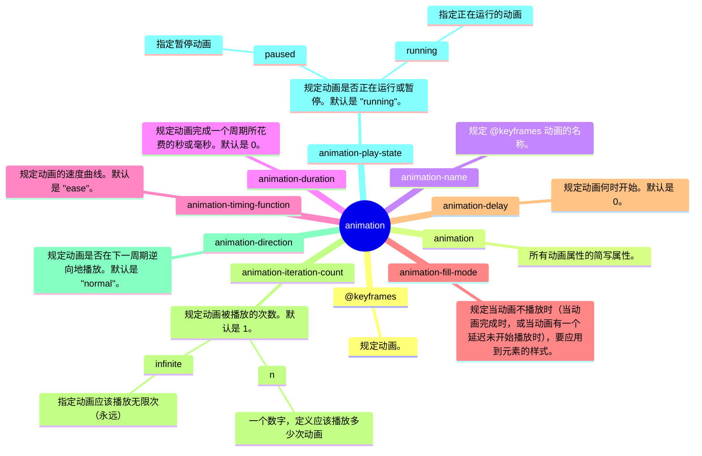
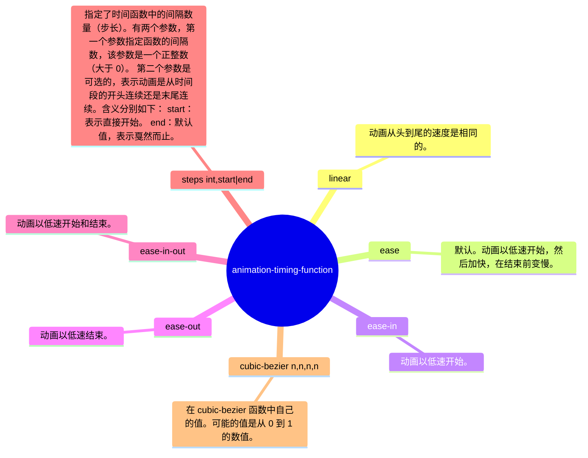
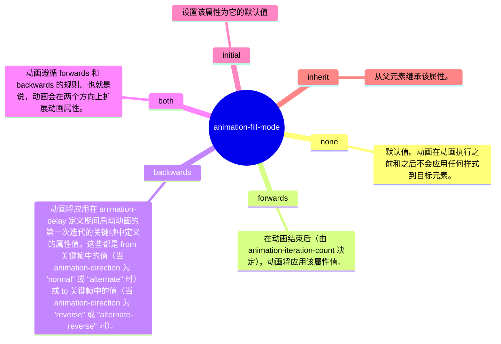
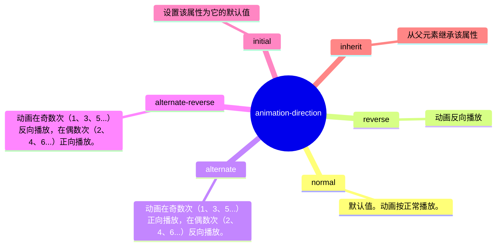

# @keyframes




## @keyframes

```css
@keyframes mymove
{
from {top:0px;}
to {top:200px;}
}
```

或

```css
@keyframes mymove
{
0% {top:0px;}
100% {top:200px;}
}
```

## animation

```css
animation-name: myfirst;
animation-duration: 5s;
animation-timing-function: linear;
animation-delay: 2s;
animation-iteration-count: infinite;
animation-direction: alternate;
animation-play-state: running;
```

等效

```css
animation: myfirst 5s linear 2s infinite alternate;
```

## animation-timing-function




## animation-fill-mode




## animation-direction


