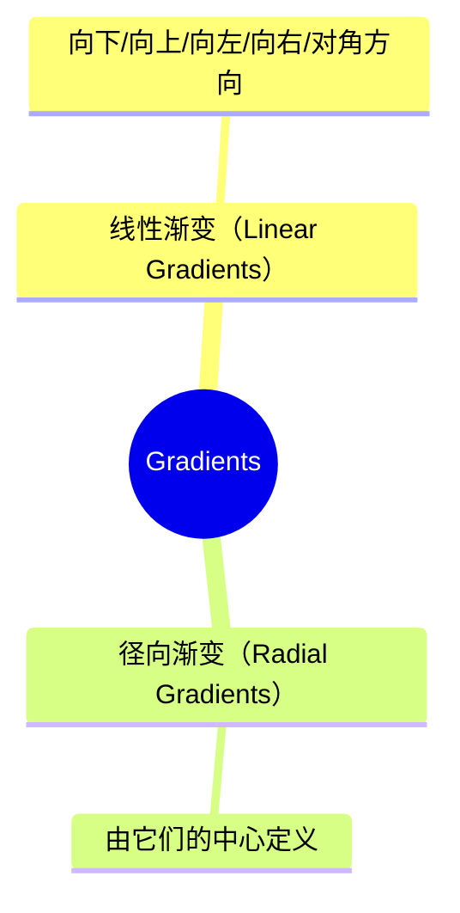

# 线性渐变（Linear Gradients）




## 线性渐变（Linear Gradients）

### 方向

```css
#grad {
  background-image: linear-gradient(#e66465, #9198e5);
}
```
```css
#grad {
  height: 200px;
  background-image: linear-gradient(to right, red , yellow);
}
```
```css
#grad {
  height: 200px;
  background-image: linear-gradient(to bottom right, red, yellow);
}
```

### 角度

-   0deg 将创建一个从下到上的渐变，90deg 将创建一个从左到右的渐变。

```css
#grad1 {
  height: 100px;
  background-color: red; /* 浏览器不支持的时候显示 */
  background-image: linear-gradient(0deg, red, yellow); /*从下到上*/
}

#grad2 {
  height: 100px;
  background-color: red; /* 浏览器不支持的时候显示 */
  background-image: linear-gradient(90deg, red, yellow);  /*从左到右*/
}

#grad3 {
  height: 100px;
  background-color: red; /* 浏览器不支持的时候显示 */
  background-image: linear-gradient(180deg, red, yellow);  /*从上到下*/
}

#grad4 {
  height: 100px;
  background-color: red; /* 浏览器不支持的时候显示 */
  background-image: linear-gradient(-90deg, red, yellow);  /*从右到左*/
}
```

### 透明度

```css
#grad {
  background-image: linear-gradient(to right, rgba(255,0,0,0), rgba(255,0,0,1));
}
```

### 重复渐变

-   `repeating-linear-gradient()` 函数用于重复线性渐变：

```css
#grad {
  /* 标准的语法 */
  background-image: repeating-linear-gradient(red, yellow 10%, green 20%);
}
```

## 径向渐变（Radial Gradients）

```css
#grad {
  background-image: radial-gradient(red, yellow, green);
}
```
```css
#grad {
  background-image: radial-gradient(red 5%, yellow 15%, green 60%);
}
```

### 形状

-   circle 表示圆形，
-   ellipse 表示椭圆形。
-   默认值是 ellipse。

```css
#grad {
  background-image: radial-gradient(circle, red, yellow, green);
}
```

### 不同尺寸大小关键字的使用

size 参数定义了渐变的大小。它可以是以下四个值：

| 关键字 | 描述 |
| --- | --- |
| closest-side | 渐变结束的边缘形状与容器距离渐变中心点最近的一边相切（圆形）或者至少与距离渐变中心点最近的垂直和水平边相切（椭圆）。 |
| closest-corner | 渐变结束的边缘形状与容器距离渐变中心点最近的一个角相交。 |
| farthest-side | 与 closest-side 相反，边缘形状与容器距离渐变中心点最远的一边相切（或最远的垂直和水平边）。 |
| farthest-corner | 渐变结束的边缘形状与容器距离渐变中心点最远的一个角相交。 |

```css
#grad1 {
  background-image: radial-gradient(closest-side at 60% 55%, red, yellow, black);
}
 
#grad2 {
  background-image: radial-gradient(farthest-side at 60% 55%, red, yellow, black);
}
```

### 重复渐变

```css
#grad {
  background-image: repeating-radial-gradient(red, yellow 10%, green 15%);
}
```
