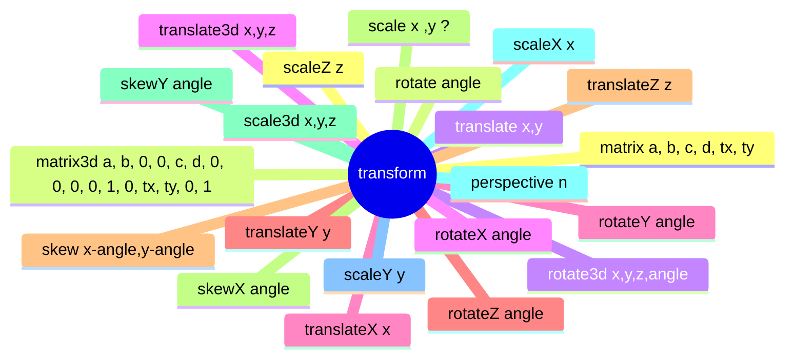

# 变形,transform




## none

```html
<!DOCTYPE html>
<html lang="en">
  <head>
    <meta charset="UTF-8" />
    <meta http-equiv="X-UA-Compatible" content="IE=edge" />
    <meta name="viewport" content="width=device-width, initial-scale=1.0" />
    <title>Document</title>
    <style>
      .box {
        width: 100px;
        height: 100px;
        background: red;
        transform: none;
      }
    </style>
  </head>
  <body>
    <div class="box"></div>
  </body>
</html>

```


## matrix

```html
matrix( scaleX(), skewY(), skewX(), scaleY(), translateX(), translateY() )
```
