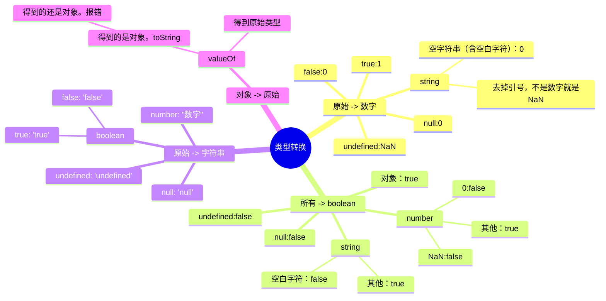

# JS-类型转换

```mermaid
mindmap
  root((类型转换))
    原始 -> 数字
      true:1
      false:0
      null:0
      undefined:NaN
      string
        空字符串（含空白字符）：0
        去掉引号，不是数字就是NaN
    所有 -> boolean
      null:false
      undefined:false
      number
        0:false
        NaN:false
        其他：true
      string
        空白字符：false
        其他：true
      对象：true
    原始 -> 字符串
      null: 'null'
      undefined: 'undefined'
      number: "数字"
      boolean
        true: 'true'
        false: 'false'
    对象 -> 原始
      valueOf
        得到的是对象。toString
          得到的还是对象。报错
        得到原始类型
```
