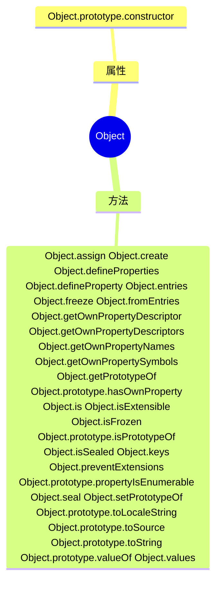

# Object

## MDN: [href](https://developer.mozilla.org/zh-CN/docs/Web/JavaScript/Reference/Global_Objects/Object)




## Object.assign

> 合并对象

> MDN : **Object.assign()** 方法将所有可枚举（Object.propertyIsEnumerable() 返回 true）和自有（Object.hasOwnProperty() 返回 true）属性从一个或多个源对象复制到目标对象，返回修改后的对象。

### 语法

```javascript
Object.assign(target, ...sources)
```

-   target

目标对象，接收源对象属性的对象，也是修改后的返回值。

-   sources

源对象，包含将被合并的属性。

### 基础用法

-   会改变原对象

```javascript
let a = {
  aName: "123",
};
let b = {
  bName: "123123",
};
let c = Object.assign(a, b);
console.log(a, b, c);
```


### 合并对象

-   不改变原对象

```javascript
let a = {
  aName: "123",
};
let b = {
  bName: "123123",
};
let c = Object.assign({}, a, b);
console.log(a, b, c);
```


### 属性覆盖

-   后面的源对象的属性将类似地覆盖前面的源对象的属性

```javascript
let a = {
  aName: "123",
  age: 13,
};
let b = {
  bName: "123123",
  age: 24,
};
let c = Object.assign({}, a, b);
console.log(a, b, c);
```


### source 对象值为 null 或 undefined

-   Object.assign() 不会在 source 对象值为 null 或 undefined 时抛出错误。

```javascript
let a = {
  aName: "123",
  age: 13,
};
let b = undefined;
let c = Object.assign(a, b);
console.log(a, b, c);
```


## Obeject.create

> 创建对象

> **Object.create()** 方法创建一个新对象，使用现有的对象来提供新创建的对象的 \_\_proto\_\_。

### 语法

```javascript
Object.create(proto，[propertiesObject])
```

-   proto

必填。新创建对象的原型对象。

-   propertiesObject

可选。需要传入一个对象，该对象的属性类型参照Object.defineProperties()的第二个参数。如果该参数被指 定且不为 undefined，该传入对象的自有可枚举属性 (即其自身定义的属性，而不是其原型链上的枚举属性) 将为新创建的对象添加指定的属性值和对应的属性描述符。

### 基础用法

```javascript
let a = Object.create({});
console.log(a); // { }
```

等价于

```javascript
var a = Object.create(Object.prototype);
var b = new Object();
```

### 继承其他对象

```javascript
// 原型对象
var A = {
  print: function () {
    console.log('hello');
  }
};

// 实例对象
var B = Object.create(A);

Object.getPrototypeOf(B) === A // true
B.print() // hello
B.print === A.print // true
```

### 不继承任何属性

```javascript
var obj = Object.create(null);

obj.valueOf()
// TypeError: Object [object Object] has no method 'valueOf'
```

-   上面代码中，对象obj的原型是null，它就不具备一些定义在Object.prototype对象上面的属性

### propertiesObject

```javascript
var obj = Object.create({}, {
  p1: {
    value: 123,
    enumerable: true,
    configurable: true,
    writable: true,
  },
  p2: {
    value: 'abc',
    enumerable: true,
    configurable: true,
    writable: true,
  }
});

// 等同于
var obj = Object.create({});
obj.p1 = 123;
obj.p2 = 'abc';
```

### 自己实现

```javascript
const myCreate = function (proto) {
    if (typeof proto !== "object" && typeof proto !== "function") {
        // 类型校验
        throw new TypeError("proto必须为对象或者函数");
    } else if (proto === null) {
        // null 特殊处理
        throw new Error("在浏览器中暂不支持传递null");
    }

    // 创建一个构造函数
    function F() {}
    // 更改其 prototype
    F.prototype = proto;

    // 返回构造的实例， 这个时候返回的实例和传入的 proto中间多了一层 F
    return new F();
};

```
