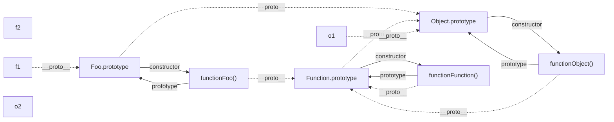

# 原型&原型链

## 参考

-   ​[https://www.cnblogs.com/chengzp/p/prototype.html](https://www.cnblogs.com/chengzp/p/prototype.html)
-   [https://juejin.cn/post/6934498361475072014](https://juejin.cn/post/6934498361475072014)
-   [https://juejin.cn/post/7098656472136941576](https://juejin.cn/post/7098656472136941576)

```vue
function Test() {}

const test = new Test();

console.log(Test.prototype === test.__proto__); // true
```

  

## 经典图解




## 四个规则

> 1.  引用类型，都具有对象特性，即可自由扩展属性。
> 2.  引用类型，都有一个隐式原型 \_\_proto\_\_ 属性，属性值是一个普通的对象。
> 3.  引用类型，隐式原型 \_\_proto\_\_ 的属性值指向它的构造函数的显式原型 prototype 属性值。
> 4.  当你试图得到一个对象的某个属性时，如果这个对象本身没有这个属性，那么它会去它的隐式原型 \_\_proto\_\_（也就是它的构造函数的显式原型 prototype）中寻找。

## **什么是原型对象？实例？构造函数？**

-   创建一个对象

```javascript
function M (name) { 
  this.name = name; 
}
var o3 = new M('o3')
```

-   实例就是对象，在本例中o3就是**实例**，M就是**构造函数**。
-   实例通过new一个构造函数生成的。
-   从上图中可以知道，实例的\_\_protpo\_\_指向的是**原型对象**。
-   实例的构造函数的prototype也是指向的原型对象。
-   原型对象的construor指向的是构造函数。
-   

  

## 原型

-   JS中的对象包含了一个prototype的内部属性，这个属性所对应的就是该对象的原型。。

  

> 1.定义：原型是 function 对象的一个属性，它定义了构造函数制造出的对象的公共祖
> 
> 先。通过该构造函数产生的对象，可以继承该原型的属性和方法。原型也是对象。
> 
> 2.利用原型特点和概念，可以提取共有属性。
> 
> 3.对象属性的增删和原型上属性增删改查。
> 
> 4.对象如何查看原型 ==> 隐式属性 \_\_proto\_\_。
> 
> 5.对象如何查看对象的构造函数 ==> constructor。

## 原型链

-   proto是每个对象都有的属性，而js里万物皆对象，所以会形成一条proto连起来的链条，递归访问proto必须最终到头，且值为null，当js引擎查找对象属性时，先查找对象本身是否存在该属性，如果不存在，会在原型链中查找，但不会查找自身的prototype。

  

-   简单理解就是原型组成的链，对象的\_\_proto\_\_它的是原型，而原型也是一个对象，也有\_\_proto\_\_属性，原型的\_\_proto\_\_又是原型的原型，就这样可以一直通过\_\_proto\_\_想上找，这就是原型链，当向上找找到Object的原型的时候，这条原型链就算到头了。

​  

> 1、如何构成原型链?
> 
> 2、原型链上属性的增删改查
> 
> 原型链上的增删改查和原型基本上是一致的。只有本人有的权限，子孙是没有的。
> 
> 3、谁调用的方法内部 this 就是谁-原型案例
> 
> 4、绝大多数对象的最终都会继承自 Object.prototype
> 
> 5、Object.create(原型);
> 
> 6、原型方法上的重写

  

## MDN

-   [https://developer.mozilla.org/zh-CN/docs/Web/JavaScript/Inheritance\_and\_the\_prototype\_chain](https://developer.mozilla.org/zh-CN/docs/Web/JavaScript/Inheritance_and_the_prototype_chain)

MDN对原型与原型链的解释：

-   当谈到继承时，**JavaScript** 只有一种结构：对象。每个实例对象（ **object** ）都有一个私有属性（称之为 **\_\_proto\_\_** ）指向它的**构造函数的原型对象**（**prototype**）。该原型对象也有一个自己的原型对象( **\_\_proto\_\_** ) ，层层向上直到一个对象的原型对象为null。根据定义，null没有原型，并作为这个**原型链**中的最后一个环节。

## 原型以及原型链对应的关系？

```javascript
Object.__proto__ === Function.prototype;
Function.prototype.__proto__ === Object.prototype;
Object.prototype.__proto__ === null;
```

​  

-   **首先**js里万物皆对象，每个对象都有proto的属性，所以会形成一条proto连起来的链条，递归访问proto必须最终到头，且值为null，当js引擎查找对象属性时，先查找对象本身是否存在该属性，如果不存在，会在原型链中查找，但不会查找自身的prototype。

## 补

```javascript
var obj = Object.create(null)
// 不是所有的对象都继承 Object.prototype 
```
