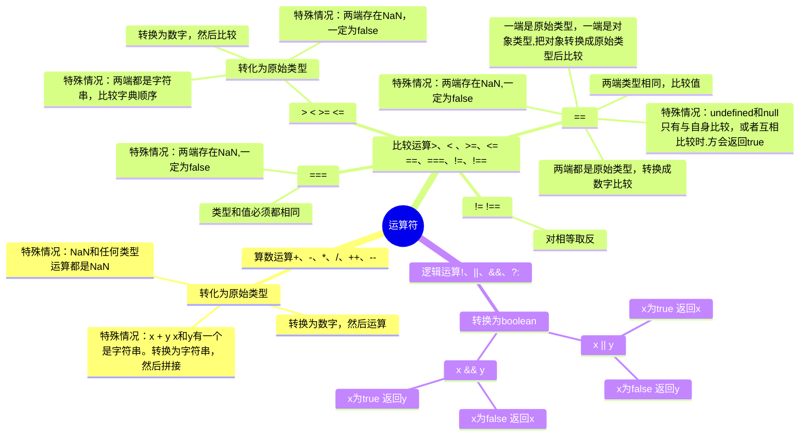

# 文档

## 




## ||

> 当其中存在值为“真”时，取第一个为“真”的值；
> 
> 当其中每一个值都为“假”时，取最后一个值；

`console.log(**ture** || true || true)`​

`console.log(false || **true** || true)`​

`console.log(false || false || **false**)`​

---

## &&

> 当其中每一个值都为“真”时，取最后一个值；
> 
> 当其中存在值为“假”时，取第一个为“假”的值；

`console.log(ture && true && **true**)`​

`console.log(ture && **false** && true)`

`console.log(**false** && true && true)`

---

## ??

> 当左侧的操作数为 null 或者 undefined 时，返回其右侧操作数，否则返回左侧操作数。
> 
> 用作函数赋默认值。

```typescript
let res = "" ?? "a";
console.log(res); // ''

let res = false ?? "a";
console.log(res); // false

let res = null ?? "a";
console.log(res); // 'a'

let res = undefined ?? "a";
console.log(res); // 'a'

let res = true ?? "a";
console.log(res); // true

let res = "A" ?? "a";
console.log(res); //A
```
```typescript
function (name, age) {
  name = name ?? 'CYQ'
  age = age ?? 23
}
```
---

## 逻辑位运算符

### &

> “&”运算符（位与）用于对两个二进制操作数逐位进行比较，并根据下表所示的换算表返回结果。

| 第一个数的位值 | 第二个数的位值 | 运算结果 |
| --- | --- | --- |
| 1 | 1 | 1 |
| 1 | 0 | 0 |
| 0 | 1 | 0 |
| 0 | 0 | 0 |


```vue
console.log(12&5); // 4
```
---

### |

> “|”运算符（位或）用于对两个二进制操作数逐位进行比较，并根据如表格所示的换算表返回结果。

| 第一个数的位值 | 第二个数的位值 | 运算结果 |
| --- | --- | --- |
| 1 | 1 | 1 |
| 1 | 0 | 1 |
| 0 | 1 | 1 |
| 0 | 0 | 0 |


```vue
console.log(12&5); // 13
```
---

### ^

> “^”运算符（位异或）用于对两个二进制操作数逐位进行比较，并根据如表格所示的换算表返回结果。

| 第一个数的位值 | 第二个数的位值 | 运算结果 |
| --- | --- | --- |
| 1 | 1 | 0 |
| 1 | 0 | 1 |
| 0 | 1 | 1 |
| 0 | 0 | 0 |


```vue
console.log(12^5); // 9
```

> 🤔
> 
> 1.交换律：a ^ b ^ c &lt;=> a ^ c ^ b
> 
> 2.任何数于0异或为任何数 0 ^ n => n
> 
> 3.相同的数异或为0: n ^ n => 0

---

### ~

> “~”运算符（位非）用于对一个二进制操作数逐位进行取反操作。
> 
> -   第 1 步：把运算数转换为 32 位的二进制整数。
> -   第 2 步：逐位进行取反操作。
> -   第 3 步：把二进制反码转换为十进制浮点数。


```vue
console.log( ~ 12 );  //返回值-13
```

> 位非运算实际上就是对数字进行取负运算，再减 1。

```vue
console.log( ~ 12 == 12-1);  //返回true
```
---

### &lt;<

---

### \>>

---

### \>>>
