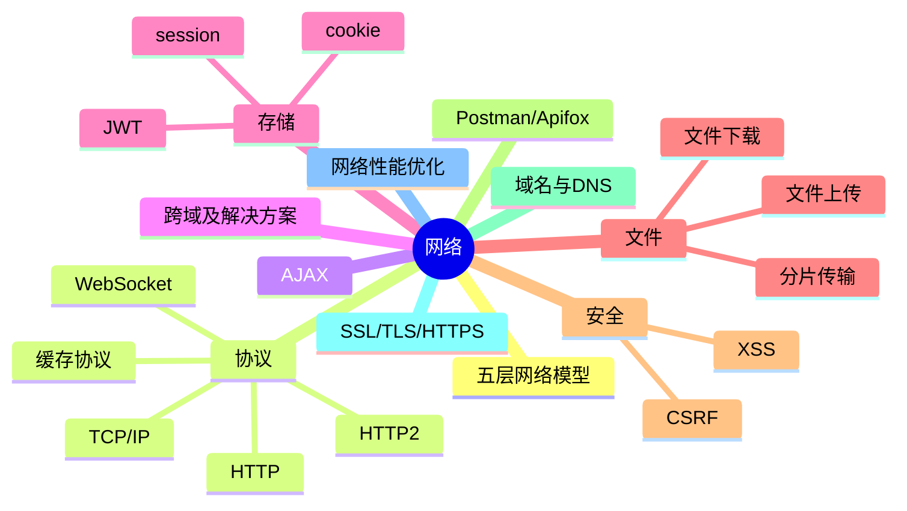

# 网络学习路线

```mermaid
mindmap
  root((网络))
    五层网络模型
    协议
      TCP/IP
      HTTP
      HTTP2
      WebSocket
      缓存协议
    AJAX
    跨域及解决方案
    存储
      JWT
      cookie
      session
    文件
      文件上传
      文件下载
      分片传输
    安全
      CSRF
      XSS
    Postman/Apifox
    域名与DNS
    SSL/TLS/HTTPS
    网络性能优化
```
