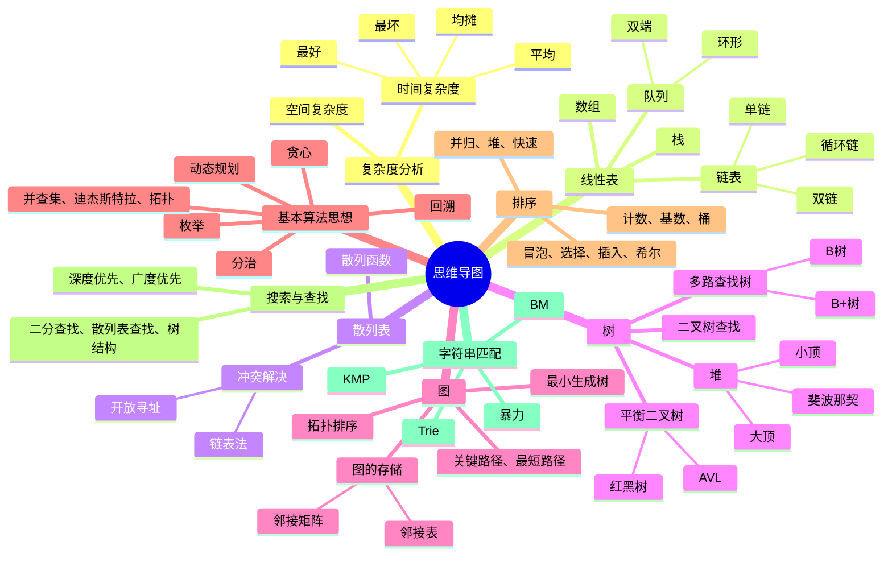

# 路线

```mermaid
mindmap
  root((思维导图))
    复杂度分析
      空间复杂度
      时间复杂度
        最好
        最坏
        平均
        均摊
    线性表
      数组
      链表
        单链
        双链
        循环链
      栈
      队列
        双端
        环形
    散列表
      散列函数
      冲突解决
        链表法
        开放寻址
    树
      二叉树查找
      平衡二叉树
        AVL
        红黑树
      多路查找树
        B树
        B+树
      堆
        小顶
        大顶
        斐波那契
    图
      图的存储
        邻接矩阵
        邻接表
      关键路径、最短路径
      最小生成树
      拓扑排序
    基本算法思想
      动态规划
      贪心
      回溯
      分治
      枚举
      并查集、迪杰斯特拉、拓扑
    排序
      冒泡、选择、插入、希尔
      并归、堆、快速
      计数、基数、桶
    搜索与查找
      深度优先、广度优先
      二分查找、散列表查找、树结构
    字符串匹配
      暴力
      BM
      KMP
      Trie
```
