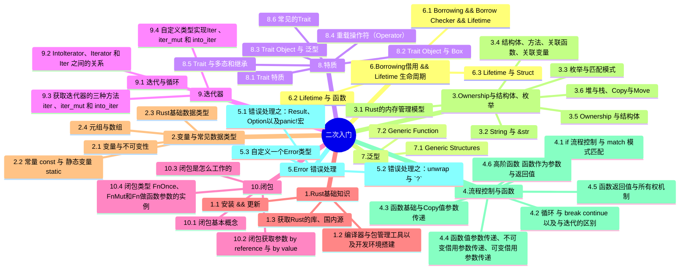

# Rust-二次入门

学习：[https://www.bilibili.com/video/BV15y421h7j7/?spm\_id\_from=333.999.0.0&vd\_source=abab9d7dbda0748f609013ac799c9002](https://www.bilibili.com/video/BV15y421h7j7/?spm_id_from=333.999.0.0&vd_source=abab9d7dbda0748f609013ac799c9002)

