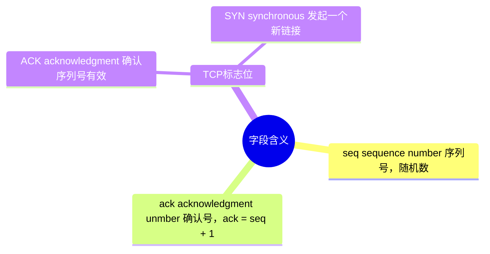

# TCP三次握手

```mermaid
mindmap
  root((字段含义))
    seq sequence number 序列号，随机数
    ack acknowledgment unmber 确认号，ack = seq + 1
    TCP标志位
      ACK acknowledgment 确认序列号有效
      SYN synchronous 发起一个新链接
```
