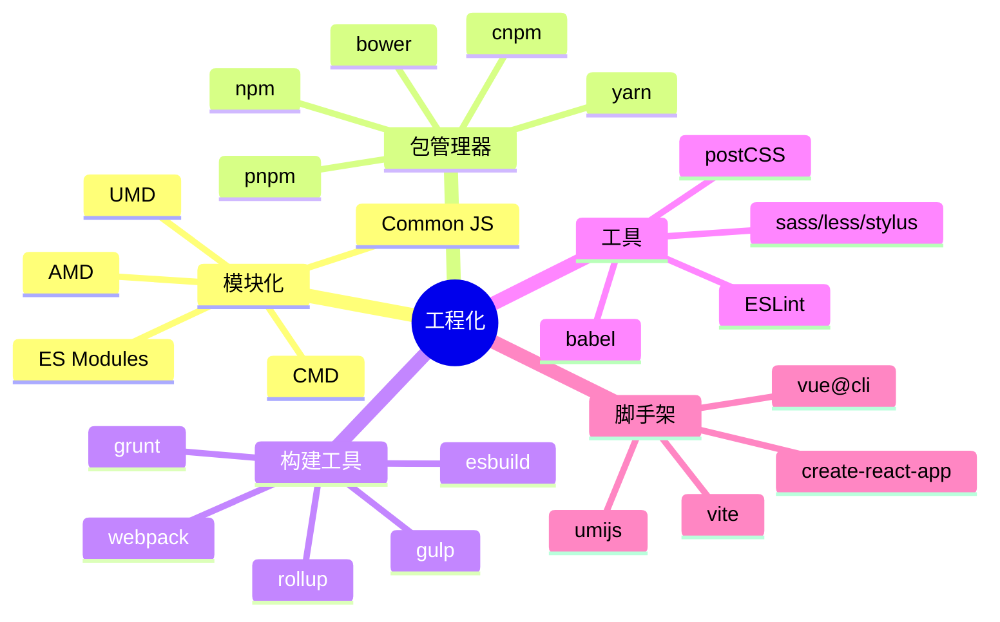

# 工程化学习路线

```mermaid
mindmap
  root((工程化))
    模块化
      UMD
      CMD
      AMD
      ES Modules
      Common JS
    包管理器
      npm
      yarn
      cnpm
      pnpm
      bower
    构建工具
      webpack
      rollup
      grunt
      esbuild
      gulp
    工具
      babel
      sass/less/stylus
      postCSS
      ESLint
    脚手架
      vite
      vue@cli
      umijs
      create-react-app
```
