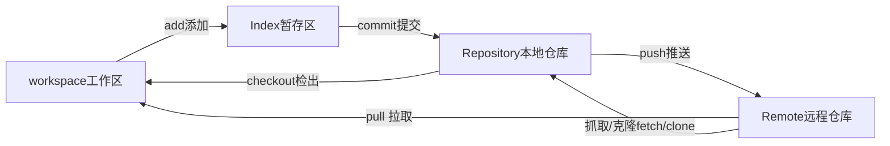

# git-start

## what

-   菜鸟教程 `[https://www.runoob.com/git/git-tutorial.html](https://www.runoob.com/git/git-tutorial.html)`
-   官网`[https://git-scm.com/](https://git-scm.com/)`

## 安装

-   macOS:

-   安装`xcode`自带
-   不用`xcode`,终端 `git --version`，按提示安装。

-   windows: 官网下载安装（傻瓜式安装）
-   linux:

-   ubuntu:`sudo apt install git-all`
-   centOS:`sudo yum install git`

-   `git --version`检查是否安装成功

## 帮助

> `git` || `git --help`

## 初始化配置

### 查看配置和文件位置

> `git config --list --show-origin`

### 设置用户名和邮箱

> `git config --global user.name "usrename"`
> 
> `git config --global user.email "email"`

-   其他配置

> `git config --global 配置名 "配置值"`

​  

# 工作流程

## 流程图

## 基本流程

-   1.使用gt命令将远程仓库上的文件克隆到本地仓库中
-   2.从本地仓库中检出文件到工作区（一般都自动完成）
-   3.将新创建的文件添加到暂存区
-   4.将暂存区中的内容提交到本地仓库
-   5.将本地仓库中的内容推送到远程仓库上

# 基础

## 初始化Git仓库

-   本地仓库

-   `git init`命令， 生成`.git`文件夹。
-   `git status`命令，显示工作目录和暂存区的状态。

-   `git status -s`简介模式显示。

-   `M`已经跟踪，有修改，未进缓存区；
-   `??`未被跟踪；
-   `A`新建的文件

-   `git add`命令，将该文件添加到暂存区。

-   `git add "file1" "file2" ...`多个文件；
-   `git add "dir"`文件夹；
-   `git add .`所有文件；

-   `git commit`命令, 将暂存区内容添加到本地仓库中。

-   `git commit -m "message"` message是一些提示语;
-   `git commit "file1" "file2" ... -m "message"`某些文件;

-   远程仓库

-   `git clone` 拷贝一个 Git 仓库到本地。

-   `git clone [url]` [url] 是你要拷贝的项目;

## 提交代码

### `git status`

-   查看文件的状态

-   `Untracked files`:未被跟踪的

-   

### `git add`

-   将该文件添加到暂存区

-   `Changes to be committed`

-   

### `git rm --cached`

-   将文件移出暂存区

-   `git rm --cached new.md`

-   

### `git commit -m`

-   将缓存区的文件添加到本地仓库

-   `git commit -m "test"`

-   

## 忽略文件跟踪

### `.gitignore`文件

-   里面写文件、文件夹不被`git`跟踪

## 查看历史和提交历史

### `git log`

-   `git log`所有的理记录
-   `git log -2`最近的几个提交
-   `git log -p`显示对文件作出实际更改的选项
-   `git log -p -2`
-   `git log --stat` 每次的记录统计
-   `git log --pretty`

## 修正提交

### `git commit --amend`

-   撤销上一次提交，并将这次提交和上次提交合并一起提交（生成新的提交）。（一般用于忘记提交某个文件，第二次补充提交）

## 取消缓存区的文件

### `git reset HEAD`

-   git add 时，误添加不想提交的文件.
-   `git reset HEAD new.md`:将此次修改的这个 file 退回到工作区
-   `git reset HEAD`:所有此次修改的 file 退回到工作区

  

# 分支
