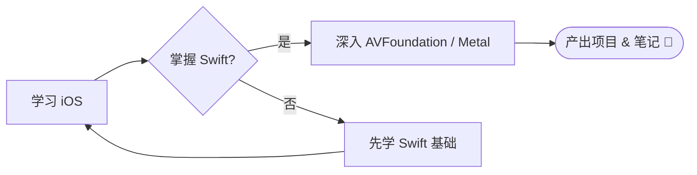
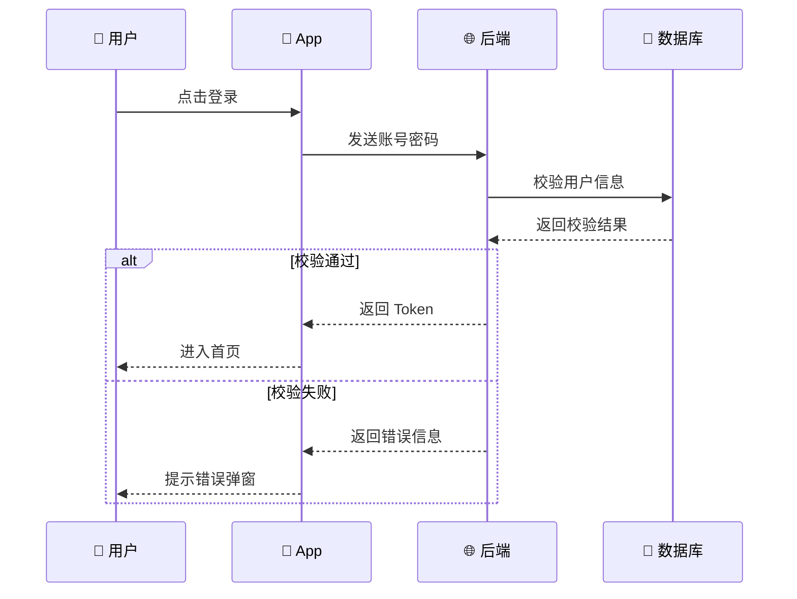
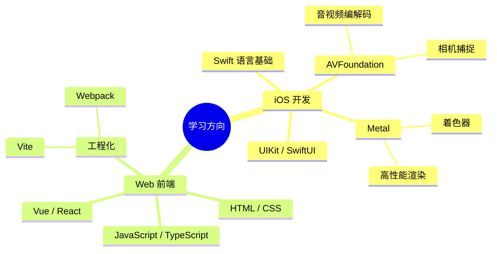
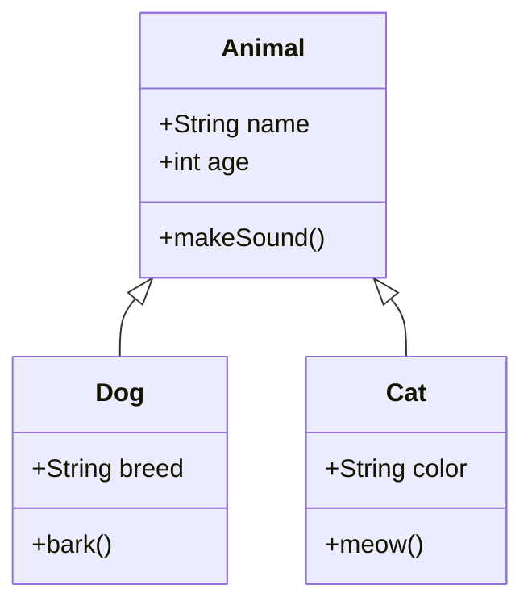
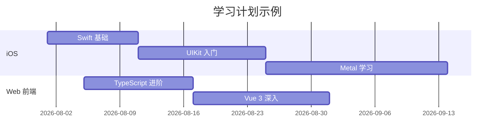

# Markdown 扩展示例

本页演示 VitePress 支持的各类 Markdown 扩展，以及本次配置的**图标、Mermaid 图、数学公式、自定义容器**等功能。

---

## 一、图标使用（Iconify 20万+ 图标）

在文档中可以直接使用 `<Icon />` 组件，图标来源涵盖 Lucide、Material Icons、FontAwesome、Tabler 等主流图标集。

### 常用图标示例

<Icon icon="lucide:rocket" width="24" height="24" />
<Icon icon="lucide:apple" width="24" height="24" />
<Icon icon="lucide:smartphone" width="24" height="24" />
<Icon icon="lucide:code-2" width="24" height="24" />
<Icon icon="lucide:book-open" width="24" height="24" />
<Icon icon="lucide:zap" width="24" height="24" />
<Icon icon="lucide:cpu" width="24" height="24" />
<Icon icon="lucide:database" width="24" height="24" />
<Icon icon="lucide:layers" width="24" height="24" />
<Icon icon="lucide:terminal" width="24" height="24" />

### 内联使用（和文字搭配）

这是一个 <Icon icon="lucide:sparkles" /> 很棒的功能，支持 <Icon icon="lucide:check-circle-2" style="color: #22c55e" /> 直接在 Markdown 中渲染。

### 彩色大图标

<Icon icon="logos:vue" width="48" height="48" />
<Icon icon="logos:react" width="48" height="48" />
<Icon icon="logos:swift" width="48" height="48" />
<Icon icon="logos:typescript-icon" width="48" height="48" />
<Icon icon="logos:nodejs-icon" width="48" height="48" />
<Icon icon="logos:vitejs" width="48" height="48" />

### 用法说明

在任意 `.md` 文件中直接写：

```vue
<!-- lucide 图标集 (推荐，现代线性风格) -->
<Icon icon="lucide:home" width="20" height="20" />

<!-- 品牌 Logo 图标集 -->
<Icon icon="logos:apple" width="32" height="32" />

<!-- Material Design 图标集 -->
<Icon icon="mdi:github" />
```

> 💡 **找图标**：去 [Iconify 官网](https://icon-sets.iconify.design/) 搜索你要的图标名，复制 `icon` 属性即可。

---

## 二、Mermaid 流程图（VitePress 内置）

### 1. 流程图 Flowchart



### 2. 时序图 Sequence Diagram



### 3. 思维导图 Mindmap



### 4. 类图 Class Diagram



### 5. 甘特图 Gantt



---

## 三、KaTeX 数学公式

### 行内公式

质能方程 $E = mc^2$ 是爱因斯坦的著名公式。

二次方程求根公式：$x = \frac{-b \pm \sqrt{b^2-4ac}}{2a}$

### 块级公式

$$
\int_{-\infty}^{\infty} e^{-x^2}\,dx = \sqrt{\pi}
$$

$$
\sum_{i=1}^{n} i = \frac{n(n+1)}{2}
$$

矩阵：

$$
A = \begin{pmatrix}
a_{11} & a_{12} & a_{13} \\
a_{21} & a_{22} & a_{23} \\
a_{31} & a_{32} & a_{33}
\end{pmatrix}
$$

---

## 四、代码高亮（含行号）

VitePress 使用 Shiki 提供语法高亮，已自动配置浅色/深色双主题。

```js{4}
export default {
  data () {
    return {
      msg: '这是第 4 行，会被高亮！'
    }
  }
}
```

```swift
// Swift 代码示例
import AVFoundation

class VideoCapture {
    private let session = AVCaptureSession()

    func startRunning() {
        guard session.isRunning == false else { return }
        session.startRunning()
        print("📹 录制已开始")
    }
}
```

```typescript
// TypeScript 代码示例
interface User {
  id:   number
  name: string
  tags: string[]
}

function greet(user: User): string {
  return `Hello, ${user.name}! 你有 ${user.tags.length} 个标签`
}
```

`diff` 语言可以看代码差异：

```diff
 function add(a, b) {
-  return a - b
+  return a + b
 }
```

### 代码组 Code Group（VitePress 内置）

::: code-group
```ts [TypeScript]
const hello: string = 'Hello VitePress'
console.log(hello)
```
```js [JavaScript]
const hello = 'Hello VitePress'
console.log(hello)
```
```swift [Swift]
let hello = "Hello VitePress"
print(hello)
```
:::

---

## 五、自定义容器

::: info
**信息提示框**：这里可以放一些中性的说明信息。
:::

::: tip
**技巧提示**：这里放一些对读者有帮助的小技巧、最佳实践。
:::

::: warning
**警告提示**：这里提示读者注意某些操作可能带来的副作用。
:::

::: danger
**危险提示**：这里强调严重错误、数据丢失风险等。
:::

::: details 点击展开查看详情
这里可以放一些不是所有人都需要看的补充内容、调试日志、FAQ 等。

```swift
// 嵌套代码示例
struct ContentView: View {
    var body: some View {
        Text("Hello, World!")
    }
}
```
:::

---

## 六、表格美化

| 功能分类       | 状态  | 说明                                |
| :------------- | :---: | :---------------------------------- |
| Mermaid 图     |  ✅   | 流程图/时序图/思维导图等 8+ 种图表   |
| 数学公式 KaTeX |  ✅   | 支持行内和块级 LaTeX 渲染           |
| Iconify 图标   |  ✅   | 20万+ 图标，支持 100+ 图标集        |
| 图片点击放大   |  ✅   | 集成 medium-zoom                    |
| 阅读进度条     |  ✅   | 页面顶部渐变色进度条                |

---

## 七、图片（可点击放大）

下面的图片可以**点击放大查看**：


> 💡 在任意 `.md` 中插入的图片都会自动支持点击缩放，如需排除可给 img 加 `data-no-zoom` 属性。
